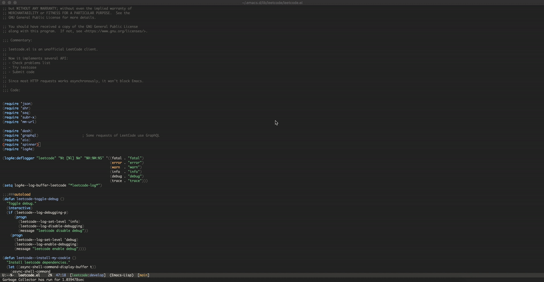
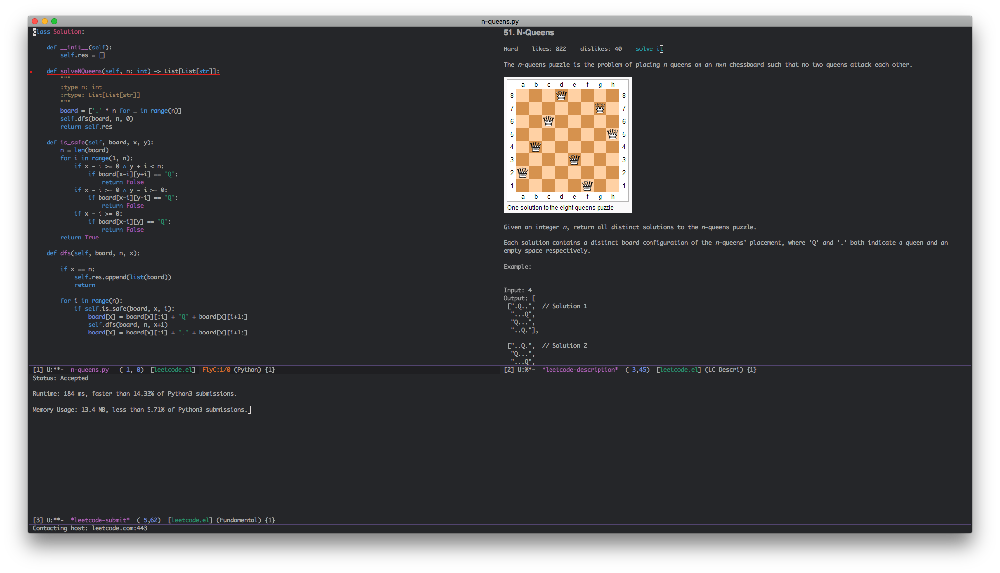

[](https://melpa.org/#/leetcode)
# Introduction

LeetCode brings you offer, and now Emacs brings you LeetCode!

# Usage



1. Execute `leetcode` command, and in problem list buffer:

| Keymap | Description                            |
|--------|----------------------------------------|
| n      | cursor move down                       |
| p      | cursor move up                         |
| l      | change prefer language                 |
| s      | filter problems by regex               |
| t      | filter problems by tag                 |
| T      | toggle tag display                     |
| d      | filter problems by difficulty          |
| /      | clear filters                          |
| g      | refresh without fetching from LeetCode |
| G      | refresh all data                       |
| RET    | show current problem description       |
| TAB    | view current problem description       |

More advanced navigation hotkeys can be found [here](#advanced-navigation).

2. Press `<RET>`, show problem description, move cursor to "solve it", press
   `<RET>` again, start coding!

3. After finishing your code, you can edit testcase and execute `leetcode-try`
   or execute `leetcode-submit`.



## Advanced Navigation

Here are some advanced navigation hotkeys that may be useful in problem list buffer:

| Keymap | Command                                    | Description                         |
|--------|--------------------------------------------|-------------------------------------|
| o      | `leetcode-show-problem`                    | show/open the current problem       |
| O      | `leetcode-show-current-problem`            | show/open a problem by id           |
| v      | `leetcode-view-problem`                    | view the current problem            |
| V      | `leetcode-view-current-problem`            | view a problem by id                |
| b      | `leetcode-show-problem-in-browser`         | show the current problem in browser |
| B      | `leetcode-show-current-problem-in-browser` | show a problem by id in browser     |
| c      | `leetcode-solve-problem`                   | start coding the current problem    |
| C      | `leetcode-solve-current-problem`           | start coding a problem by id        |

# Installation

- Vanilla Emacs: `package-install` it from melpa directly
- [Spacemacs](https://github.com/syl20bnr/spacemacs):
  [leetcode-emacs-layer](https://github.com/anmoljagetia/leetcode-emacs-layer)

LeetCode do not allow third party login, one workaround is restore LeetCode
session from local Firefox or Chrome cookies. By default, this package will
install a Python3 package called
[my\_cookies](https://github.com/kaiwk/my_cookies), or you can install it
manually: `pip3 install my_cookies`.

Since we are using [shr.el](https://www.emacswiki.org/emacs/HtmlRendering) to render HTML, you may also want to look at [shrface](https://github.com/chenyanming/shrface).

## Manually

1. Clone this repository and install all dependencies
2. Move it to your load-path
3. Require it in your emacs config

# Configuration

You can set your preferred LeetCode programming language and SQL by setting
`leetcode-prefer-language` and `leetcode-prefer-sql`:

If you prefer not to see problems' tags in the `*leetcode**`buffer by default.
set `leetcode-prefer-tag-display` to nil

```elisp
(setq leetcode-prefer-language "python3")
(setq leetcode-prefer-sql "mysql")
```

All supported languages can be found in variable
`leetcode--lang-suffixes`.

You can save solution by setting `leetcode-save-solutions`:

```elisp
(setq leetcode-save-solutions t)
(setq leetcode-directory "~/leetcode")
```

# Debug

Call `leetcode-toggle-debug`, log will output in `*leetcode-log*` buffer.

# Contributing

Please submit PR to develop branch.

# Added filter to exclude paid only questions and leetcode-show-problem-by-slug
Just use `leetcode-toggle-paid-display` to toggle if paid only should be shown.

`leetcode-show-problem-by-slug` will let you put to org files with a link in this format to show the question after the *leetcode* buffer is load like [elisp:(leetcode-show-problem-by-slug (leetcode--slugify-title "ZigZag Conversion"))]
